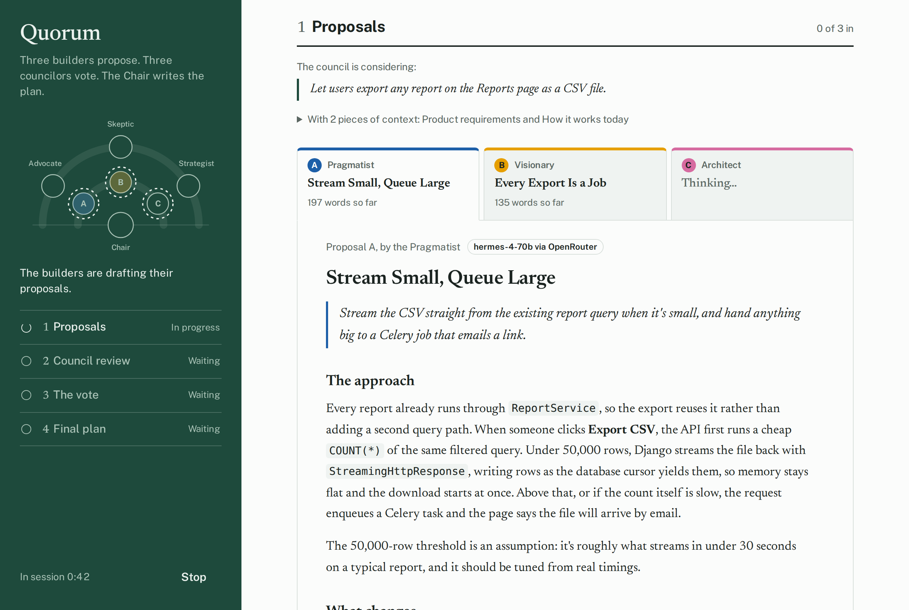
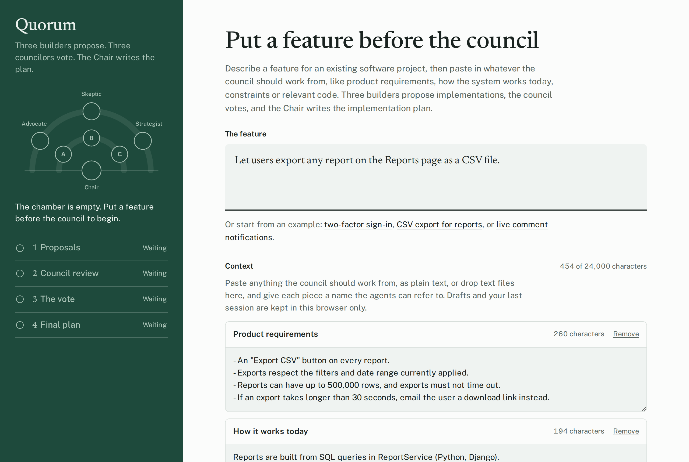
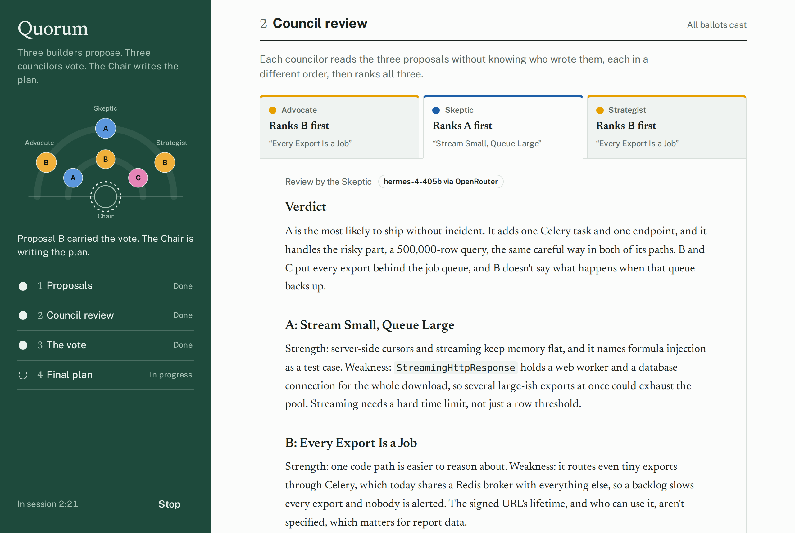
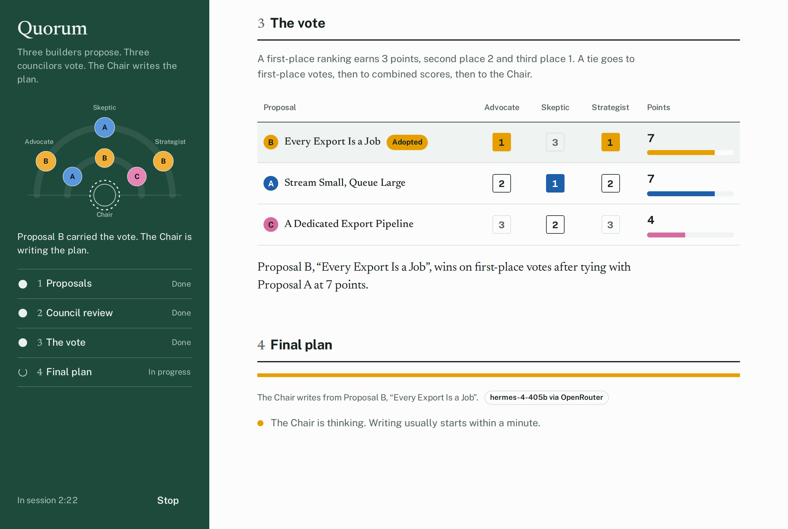
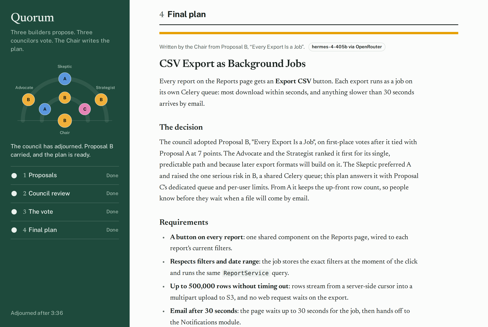
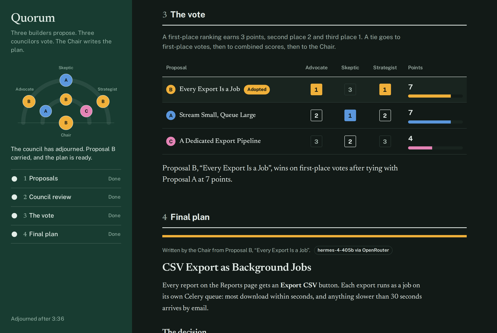

# Quorum

Decide how to implement a feature in an existing software project by putting it before a small AI council. Three builders each propose an implementation, three councilors review the proposals blind and cast ranked ballots, and a Chair counts the votes and writes the implementation plan.

Each role can run on a different provider and model: Claude inside claude.ai, and OpenRouter, Hermes Agent or any OpenAI-compatible endpoint when you run Quorum yourself.



## How a session works

You describe the feature and paste in whatever context the council should work from, as plain text: product requirements, how the system works today, constraints, relevant code or anything else. You can also drop text files onto the context, or add them with "From files…", and each comes in named after its file. Each piece gets a name, and every agent sees all of it. The agents are told to use names that appear in the context and to state assumptions rather than invent file names, endpoints or libraries. Context is limited to 24,000 characters so that every request, which carries the context along with the proposals and reviews, stays a manageable size.

1. **Proposals.** Three builders write in parallel, each with a different approach: the Pragmatist looks for the smallest change that fits the existing code, the Visionary for a better design than the obvious one, and the Architect for something that fits the system's structure and holds up as it grows.
2. **Council review.** The Advocate (users and requirements), the Skeptic (regressions, security, performance and hidden complexity) and the Strategist (effort, risk and sequencing) each review all three proposals without knowing who wrote them, each reading them in a different order. Every review ends with a ranked ballot and a score from 1 to 10 for each proposal.
3. **The vote.** A first-place ranking earns 3 points, second place 2 and third place 1. A tie goes to first-place votes, then to combined scores, then to the Chair.
4. **Implementation plan.** The Chair writes the plan from the winning proposal, covering requirements, design, changes by area, implementation steps, testing, rollout, risks and open questions. It folds in the best ideas from the other proposals and answers any councilor who ranked the winner last.

A session makes seven requests. The finished plan can be copied or downloaded, along with a full record of the request, the context, every proposal and review, the vote and which model each seat ran on. The page keeps your last session in the browser, so reloading it brings the session back, and a session that hadn't finished can be resumed where it stopped.

## What a session looks like

These screenshots follow the "CSV export for reports" example on the page, with the default OpenRouter setup. They were recorded by `npm run screenshots`, which plays a scripted session through the real page, so the agents' words were written for the demo rather than by the models named on them, and the session timer is moved forward the way minutes would pass in a real session.

**Putting a feature before the council.** The feature, and the context the council works from.



**Council review.** Each councilor reviews the proposals blind, through their own lens, and ends with a ranked ballot. The seating chart shows each councilor's first choice.



**The vote.** The ballots are counted. Here A and B tie on points, and B wins on first-place votes.



**The plan.** The Chair writes the implementation plan from the winner, folds in ideas from the other proposals, and answers the councilor who ranked the winner last.



The page follows your system's light or dark setting.



## Agents and providers

Under Agents, each role (the builders, the council and the Chair) gets a provider and a model. A common setup puts the builders on a cheaper model and the council and the Chair on a frontier one. A separate Length setting (Brief, Standard or Detailed) sets how long each document is. The page remembers your choices in your browser, and every byline shows which model wrote it.

Which providers you can use depends on where the page is open:

- **Inside claude.ai**, as a published artifact, every agent runs on Claude through the artifact runtime. You pick a tier per role (Fast, Balanced or Frontier), and requests run on the Claude account of whoever opens the page. Pages published on Claude can't reach other services, so the other providers are switched off there.
- **On your own computer or site**, agents run on OpenRouter, Hermes Agent or any other OpenAI-compatible endpoint, with your own keys. Requests go straight from your browser to the provider.

### Running it yourself

```sh
npm start
```

This builds the page and serves it at http://localhost:8765. You can also open `dist/quorum.html` directly as a file, which works for OpenRouter, but Hermes Agent and other local services need the page to have a web address they can allow.

Open **Providers** on the page to add keys. Keys stay in your browser and are sent only to the service they belong to. They're forgotten when you close the page unless you tick "Remember on this device".

### OpenRouter

Create a key at https://openrouter.ai/keys and paste it under Providers. The defaults are Nous Research's Hermes 4 70B (`nousresearch/hermes-4-70b`) for the builders and Hermes 4 405B (`nousresearch/hermes-4-405b`) for the council and the Chair. The model fields suggest everything OpenRouter offers, so you can type any model ID, for example a frontier model for the council and the Chair. Requests are billed to your OpenRouter account.

### Hermes Agent

Hermes Agent's API server speaks the OpenAI chat completions format. To let Quorum use it, add this to `~/.hermes/.env`:

```sh
API_SERVER_ENABLED=true
API_SERVER_KEY=choose-a-secret
API_SERVER_CORS_ORIGINS=http://localhost:8765
```

Then run `hermes gateway`. Under Providers, the address defaults to `http://127.0.0.1:8642/v1`; paste the same `API_SERVER_KEY` and use Check connection. `API_SERVER_CORS_ORIGINS` must match the address the page is open at exactly, and the page shows its own address in the Hermes setup note.

Hermes answers with the model it's configured to use. It also has tools, so Hermes seats are told they may read the project's files to check their work against the code, and not to change anything or run anything that modifies the project. Seats on Hermes can take longer because the agent may use its tools before it writes.

### Other endpoints

Any server that speaks the OpenAI chat completions format works under "Other OpenAI-compatible endpoint", such as Ollama, LM Studio, vLLM or LiteLLM. Give its address (usually ending in `/v1`), a key if it needs one, and a model name per role. The server has to accept requests from the page's address.

### Adding a provider

Providers are described in `PROVIDERS` in `src/core.js` and called from `run()` in `src/providers.js`. An OpenAI-compatible service only needs a new entry that points `streamChat` at its address; anything else needs its own branch in `run()` that resolves `{ text, truncated, served }` or rejects with one of Quorum's error codes.

### Publishing to claude.ai

Build `dist/quorum.html` and ask Claude to publish that file as an artifact with the `sample` and `downloads` capabilities.

## Project layout

| Path | What it holds |
|---|---|
| `src/head.html` | Document head and all of the CSS |
| `src/body.html` | Page markup, including the seating chart SVG |
| `src/graph.js` | Declares a graph of steps, checks it up front, and runs it as a queue of tasks that pass each other frozen handoffs |
| `src/core.js` | Pure logic: the cast and their prompts, the session graph and what each step does, context handling, providers and models, the streaming parser, the Markdown renderer, ballot parsing, the vote count and the full-record export |
| `src/providers.js` | Calls to each provider: Claude through the artifact runtime, and streamed chat completions for OpenRouter, Hermes Agent and other endpoints |
| `src/app.js` | Running the session graph, the agents and providers settings, rendering and event handling |
| `build.js` | Assembles `src/` into `dist/quorum.html` |
| `serve.js` | Serves `dist/` at http://localhost:8765 for `npm start` |
| `dist/quorum.html` | The built single-file page |
| `test/` | Unit tests for `core.js`, and in-page tests that stand in a simulated Claude and simulated OpenRouter, Hermes Agent and custom endpoints |
| `scripts/screenshots.js` | Records the screenshots in `docs/screenshots/` by driving the built page in Chromium with a scripted OpenRouter |
| `scripts/scripted-session.js` | What each seat answers in that scripted session |

### The session graph

A session is declared up front, as `SESSION` in `src/core.js`, as a directed acyclic graph of nine steps:

| Step | Needs | Hands on |
|---|---|---|
| `brief` | Nothing. It's made when the council convenes | The feature request, the context and the length |
| `A`, `B`, `C` | `brief` | A proposal and its title |
| `advocate`, `skeptic`, `strategist` | `brief` and the three proposals | A review and its ballot |
| `tally` | The three reviews | The count |
| `chair` | Everything above | The plan, and the deciding vote if the council was deadlocked |

`src/graph.js` checks the graph before anything runs, rejecting cycles and steps that need something that isn't there. It then works through the graph as a queue of tasks. A step starts as soon as everything it needs has been handed off, so the builders write side by side, and so do the councilors. Each task carries only the handoffs its step needs. What a worker returns is copied and frozen into a handoff for the steps after it, so no step can see or change another's work. `STEPS` in `src/core.js` says how each kind of step turns its inputs into a prompt, and how it turns the agent's answer into what it hands on.

If a step fails, nothing that needs it starts. A retry runs the graph again from the handoffs already made, so only the unfinished steps are asked again.

The same holds across a reload. The page keeps the brief and what each agent wrote in the browser, and rebuilds the handoffs from them by running each step's `result` again, so a saved answer is checked the same way a fresh one is. A step whose answer no longer reads, and every step after it, simply runs again when the session is resumed.

## Build and test

Requires Node.js 18 or later.

```sh
npm install
npm start       # builds, then serves the page at http://localhost:8765
npm run build   # writes dist/quorum.html only
npm test        # rebuilds, then runs the unit and in-page tests
```

To record the screenshots again after changing the page, install Playwright and Chromium, which aren't among the project's dependencies, then run the script:

```sh
npm install --no-save playwright && npx playwright install chromium
npm run screenshots
```
